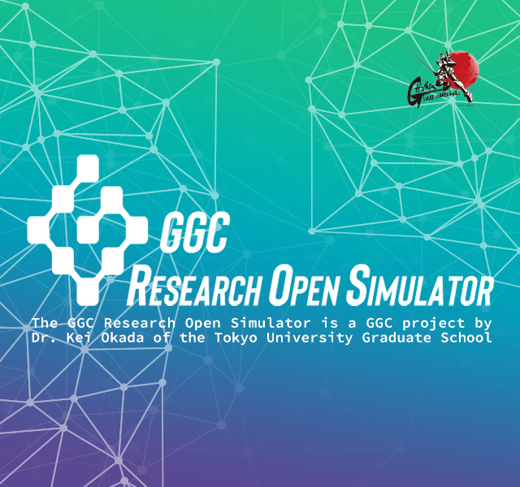

<!DOCTYPE html>
<html lang="en">
<head>
<meta charset="utf-8"> 
<meta http-equiv="content-style-type" content="text/css" />
<meta http-equiv="content-script-type" content="text/javascript" />
<meta name="viewport" content="width=device-width,initial-scale=1.0,minimum-scale=1.0,maximum-scale=1.0,user-scalable=0">
<title>GGC Research Open Simulator</title>
<meta  name="robots" content="INDEX, FOLLOW" />
<meta  name="Author" content="SOTSU・SUNRISE" />
<meta name="keywords" content="GUNDAM GLOBAL CHALLENGE" lang="en" xml:lang="en" />
<meta name="description" content="GUNDAM GLOBAL CHALLENGE" lang="en" xml:lang="en" />
<meta  name="copyright" content="SOTSU・SUNRISE" />
<!-- sns -->
<meta property="og:site_name" content="GGC Research Open Simulator" />
<meta property="og:title" content="GGC Research Open Simulator" />
<meta property="og:description" content="GGC Research Open Simulator" />
<meta property="og:url" content="https://gundam-global-challenge.github.io" />
<!-- sns end -->
<link rel="stylesheet" type="text/css" href="assets/css/magnific_popup.css" />
<link rel="stylesheet" type="text/css" href="assets/css/style.css" />

</head>
<body id="gros">

  <header>
      <h1></h1>
  </header>
  

    

      <h2>GGC Research Open Simulator</h2>
      
The GGC Research Open Simulator Project is a part of the Gundam Global Challenge

      
The GGC Research Open Simulator is a GGC project by Dr. Kei Okada of the Tokyo University Graduate School of Information Science and Technology.

      
GGC Research Open Simulator has developed an open robot platform for software and hardware by using Gundam CG data to create a system that lets youths from around the world participate in robot development. The aim is to contribute to the development of robotics and the making of "real Gundam".

      
<a href="https://github.com/gundam-global-challenge/gundam_robot" target="_blank">https://github.com/gundam-global-challenge/gundam_robot</a>

      
For more information on the project and how to participate, see the below link.

      
<a href="https://gundam-challenge.com/en/" target="_blank">Gundam Global Challenge Official Website</a>

      
<a href="https://gundam-challenge.com/en/special/opensimulator/" target="_blank">GGC Research Open Simulator Page / 3D Data Download</a>

      
<a href="#jpn" class="popupModal">Show Japanese</a>

    

  

  <!--div class="projects">
    <h2>PROJECTS</h2>
    

      <ul>
        <li>
<h3>Project title</h3>
Category

プロジェクト概要プロジェクト概要プロジェクト概要プロジェクト概要プロジェク

<a href="#">GitHub</a>
</li>
        <li>
<h3>Project title</h3>
Category

プロジェクト概要プロジェクト概要プロジェクト概要プロジェクト概要プロジェク

<a href="#">GitHub</a>
</li>
        <li>
<h3>Project title</h3>
Category

プロジェクト概要プロジェクト概要プロジェクト概要プロジェクト概要プロジェク

<a href="#">GitHub</a>
</li>
      </ul>
    

  </div-->

<footer>
  

    
<a href="https://gundam-challenge.com/en/about/index.html">Incorporated Association GUNDAM GLOBAL CHALLENGE</a>&nbsp;|&nbsp;<a href="https://gundam-challenge.com/en/contact/" target="_blank">CONTACTUS</a>

    
<a href="https://gundam-challenge.com/en/privacy/index.html" target="_blank">Privacy Policy</a>&nbsp;|&nbsp;<a href="https://gundam-challenge.com/en/agreement/index.html" target="_blank">Agreement for use / Copyright / Disclaimer</a>

    

  

</footer>

  

    

      <h2>GGCリサーチオープンシミュレーター</h2>
      
GGC Research Open Simulator はGUNDAM GLOBAL CHALLENGE （GGC）の中の1つのプロジェクトです。

      
GGC Research Open Simulatorは、GGCメンバーである東京大学大学院情報理工学系研究科　岡田慧教授によるGGCプロジェクトです。

      
実在のガンダムモビルスーツを用いてソフトウェア並びにハードウェアのオープンロボットプラットフォームを開発し、世界の若者が夢を持って自由にロボット開発に参加できる体制の創出と、ロボティクス分野のさらなる発展へ寄与し「リアルガンダム」の実現に繋げることを目指します。

      
<a href="https://github.com/gundam-global-challenge/gundam_robot" target="_blank">https://github.com/gundam-global-challenge/gundam_robot</a>

      
プロジェクトへの詳細および参加については以下リンクよりご確認ください

      
<a href="https://gundam-challenge.com/" target="_blank">GGC オフィシャルWEBサイト</a>

      
<a href="https://gundam-challenge.com/special/opensimulator/" target="_blank">GGC リサーチ オープン シミュレータ詳細ページ／ 3Dデータダウンロード ページ</a>

    

  

</body>
</html>